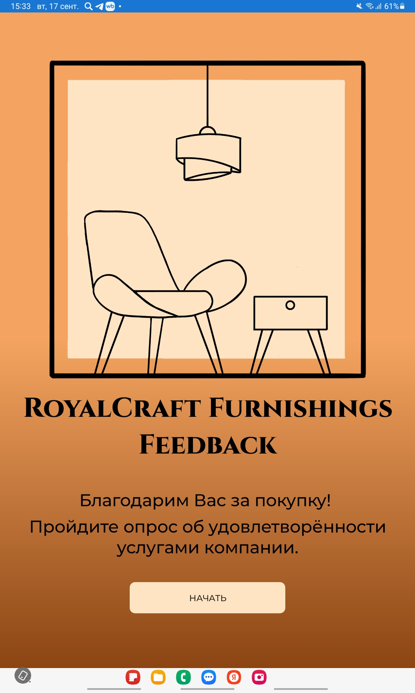
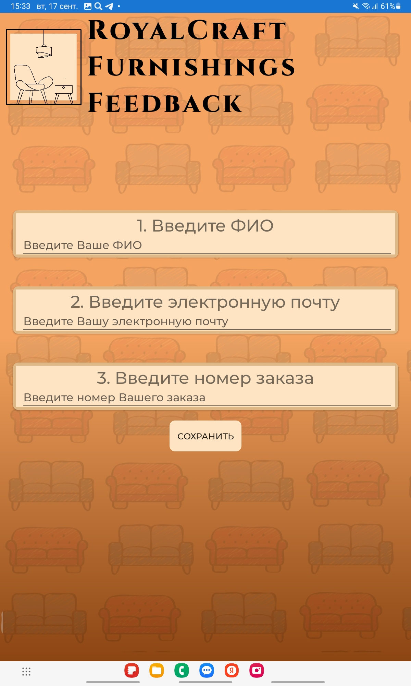
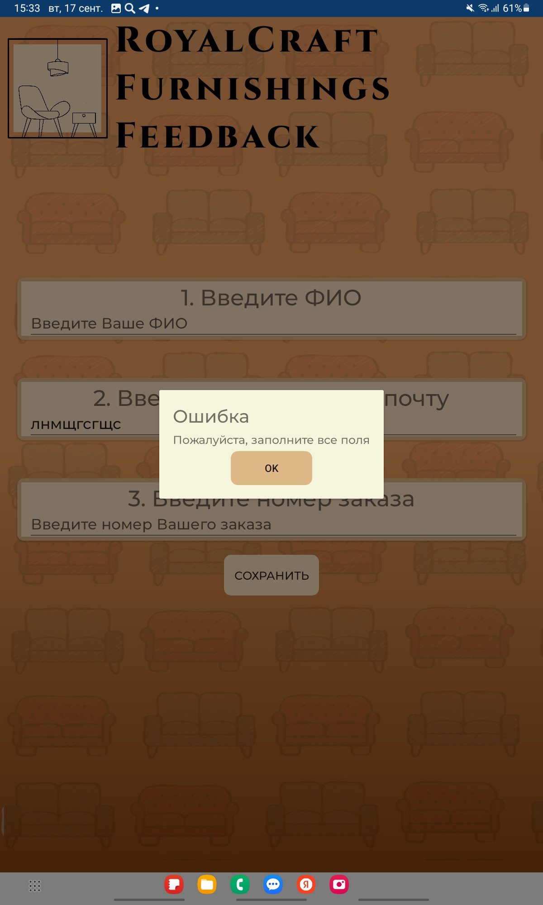
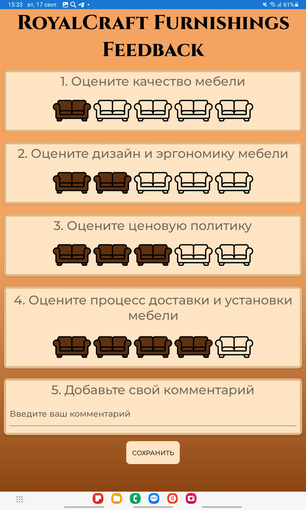
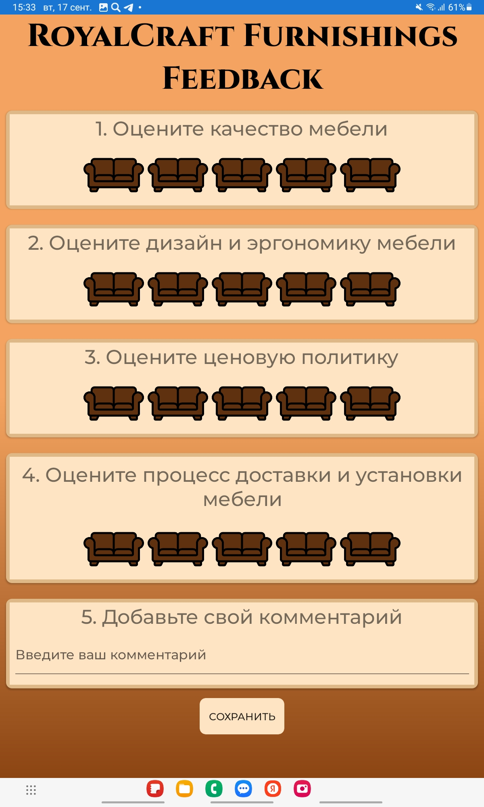
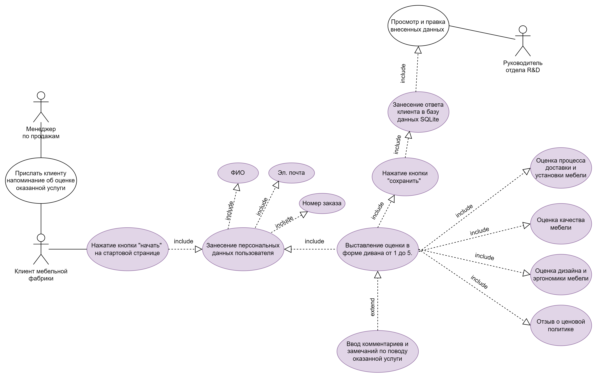
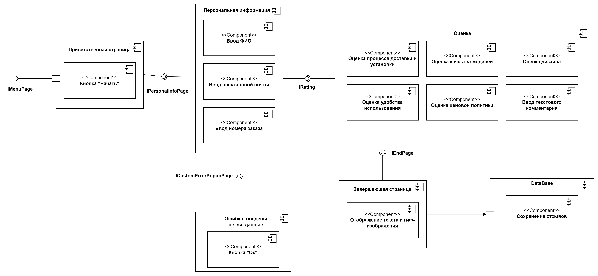

# Мобильное приложение для сбора отзывов RCFeedback
Данный репозиторий содержит проектные файлы для разработки мобильного приложения, созданного в рамках курсовой работы по автоматизации процесса сбора отзывов на мебельной фабрике "RoyalCraft Furnishings".  
## Обзор проекта
Цель проекта – автоматизировать процесс сбора отзывов от клиентов и сотрудников с помощью мобильного приложения. Это приложение позволяет клиентам оценивать качество мебели, доставки и обслуживания, а также оставлять дополнительные комментарии. Все данные сохраняются в базе данных для дальнейшего анализа и оптимизации бизнес-процессов.
## Функциональность
- _Сбор отзывов_: Пользователи могут оставлять оценки по различным аспектам сервиса (качество, доставка и др.) и добавлять комментарии.
- _Удобный интерфейс_: Приложение имеет простой и интуитивно понятный интерфейс с системой оценок и формой для обратной связи.
- _Хранение данных_: Отзывы сохраняются в базе данных SQLite для последующего анализа.
- _Автоматизированная обработка отзывов_: Собранные данные могут быть обработаны и проанализированы для оптимизации бизнес-процессов.
## Технологии
- `C#`: Основной язык программирования приложения.
- `Xamarin.Forms`: Кроссплатформенный фреймворк для разработки мобильных приложений на Android и iOS.
- `SQLite`: Используется для локального хранения данных отзывов.
## Экраны приложения
- **Приветственный экран:** Вводное сообщение и возможность начать процесс оставления отзыва.
      
- **Экран ввода личной информации:** Пользователь вводит имя, электронную почту и номер заказа.   
     
     
- **Экран оценок:** Пользователь оценивает качество мебели, доставки и обслуживания, а также оставляет комментарий.   
      
      
- **Экран благодарности:** После отправки отзыва пользователь видит сообщение с благодарностью и промокод на скидку.   
     
## UML диаграммы
Проект включает несколько UML-диаграмм для документирования системы:
- **Диаграмма вариантов использования (Use Case):** Описывает взаимодействия пользователя с системой.   
     
- **Диаграмма классов:** Показывает структуру приложения, классы и связи между ними.    
     
- **Диаграмма активности**: Описывает последовательность действий в приложении, начиная с запуска, ввода данных пользователем и до завершения процесса с сохранением отзыва в базу данных и отображением благодарности.   
     
- **Диаграмма компонентов:** Обеспечивает обзор высокоуровневых компонентов системы.   
     
- **Диаграмма развертывания:** Описывает процесс развертывания приложения на мобильных устройствах.   
     
## Установка
Для локального запуска приложения:
1. Склонируйте репозиторий
2. Установите необходимые пакеты NuGet:
`nuget restore`
3. Соберите и запустите приложение, используя эмулятор Android или iOS.
